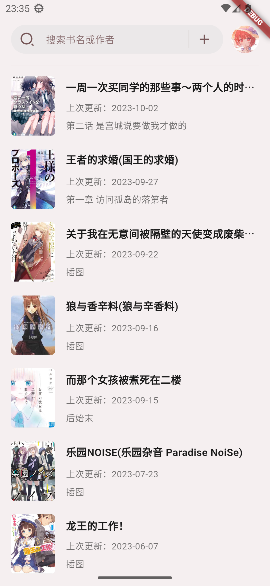
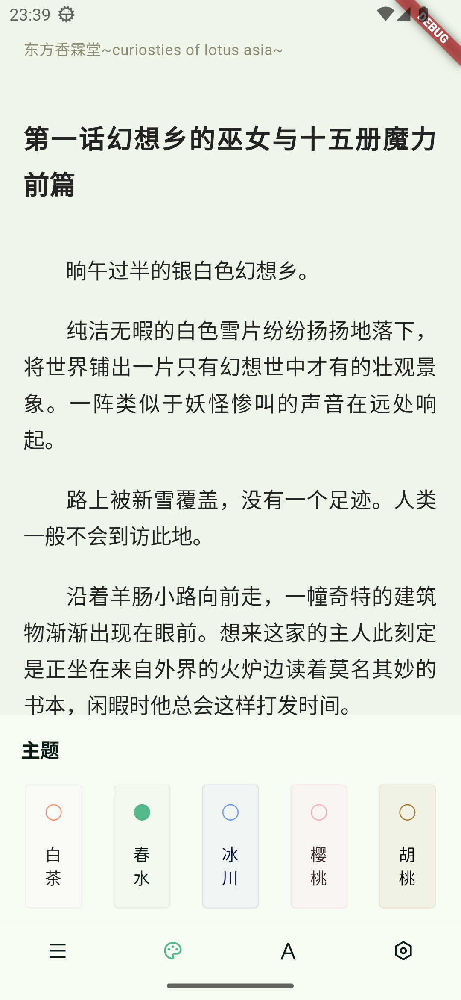

# Honzuki

A light novel reader for wenku8.net

[简体中文](README_CN.md)

## Features

- [x] Account login (currently supports username login only)
- [x] Bookshelf retrieval
- [x] Rankings
- [x] Search for books and authors
- [x] Book details
- [x] Book reading
- [x] Reading themes
- [x] Reading fonts
- [x] Table of contents related features
- [-] Reading settings (not fully implemented)
- [x] User check-in
- [x] Book caching
- [x] Color follows system theme
- [x] Material You color scheme
- [x] Theme color selection

## Screenshots

<div style="text-align: center;">


</div>

## Build

```shell
flutter pub get
flutter build $target_paltform --release
```

### Platform Support

[ ] Android -- Primary

[ ] iOS -- Untested

[ ] macOS -- Untested

[ ] Linux -- Untested

[ ] Windows -- Untested

## 声明

- This project is developed for personal interest and is intended for educational purposes only. It has no commercial intent.
- Copyrights of the resources remain with the original website or their respective owners.
- All APIs used are collected from official sources and do not contain any illegal or cracked content.

## 感谢

- [轻小说文库](https://www.wenku8.net/): Content provider.
- [light-novel-library_Wenku8_Android](https://github.com/MewX/light-novel-library_Wenku8_Android): Existing non-profit wenku8.net client.
- [wenku8x](https://github.com/zsakvo/wenku8x): Most source code come from this repository.
