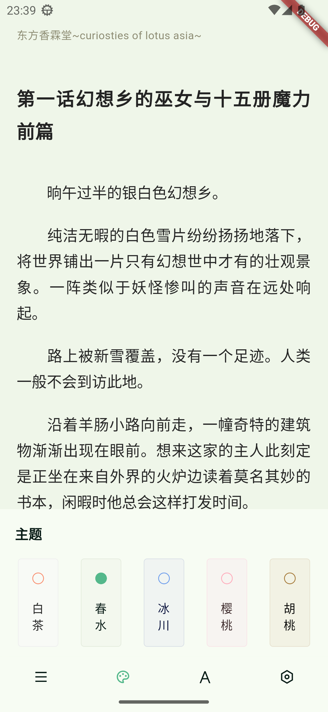

# 小书痴

基于 flutter 制作的第三方 `轻小说文库` 客户端.

## 功能实现

- [x] 账号登录(暂时仅支持用户名登入)
- [x] 书架获取
- [x] 排行榜
- [x] 搜索书籍和作者
- [x] 书籍详情
- [x] 图书阅读
- [x] 阅读主题
- [x] 阅读字体
- [x] 目录相关
- [-] 阅读设置(未完善)
- [x] 用户签到
- [x] 书籍缓存
- [x] 颜色跟随系统
- [x] Material You 配色
- [x] 主题色选取

## 截图

<div style="text-align: center;">


</div>

## 运行与编译

```shell
flutter pub get
flutter build $target_paltform --release
```

### 平台支持情况

[ ] Android -- 主要运行

[ ] iOS -- 未测试，理论可运行

[ ] macOS -- 未测试，理论可运行

[ ] Linux -- 未测试，理论可运行

[ ] Windows -- 未测试，理论可运行

## 声明

- 此项目是个人为了兴趣而开发,仅供学习交流使用,无任何商业用途.
- 资源版权仍归原网站或其作者所有.
- 所用 API 皆从官方网站收集,不含任何非法及破解内容.

## 感谢

- [轻小说文库](https://www.wenku8.net/): 内容提供
- [light-novel-library_Wenku8_Android](https://github.com/MewX/light-novel-library_Wenku8_Android): 轻小说文库既有的公益客户端
- [wenku8x](https://github.com/zsakvo/wenku8x): 大部分源代码来自该仓库
